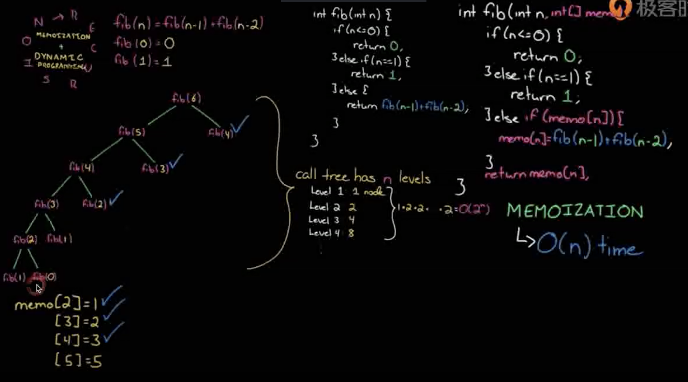
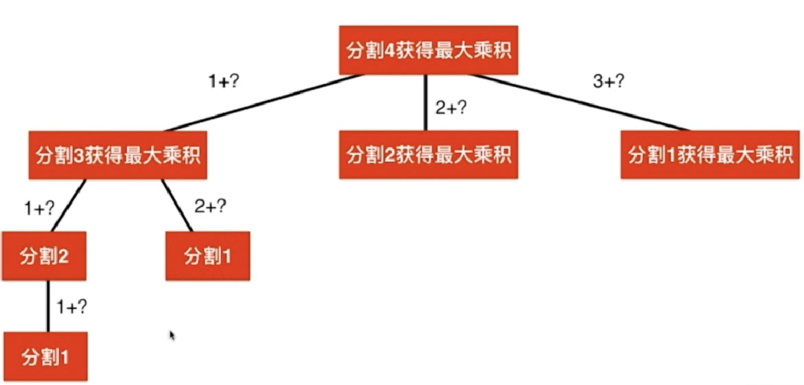

# 动态规划

## 理论

将原问题拆解成若干子问题，同时保存子问题的答案，使得每个子问题只求解一次，最终获得原问题的答案。

1. 递归+记忆化搜索 -> 递推(从树底反着推上去)
2. 状态的定义：opt[n]  , dp [n] , fib[n]
3. 状态转移方程：opt[n] = best_of(opt[n-1] , opt[n-2])
4. 最优子结构:求解子问题的最优解，就能获得原问题的最优解

## 练习

### 斐波那契数列

递归写法

递归问题-> 重叠子问题   
            1. 记忆化搜索
            2. 动态规划

递归+记忆化搜索
算过的存起来

递归和记忆化搜索：都是自上而下的解决问题。
只要是能够自上而下解决问题，就一定能够自下而上解决问题。（思考的难度会有区别）

从树的底部向上递推得到递推方程：
初始条件：F[0] = 0 , F[1] = 1  
递推方程：F[n] = F[n-1]+F[n-2]

### Integer break

