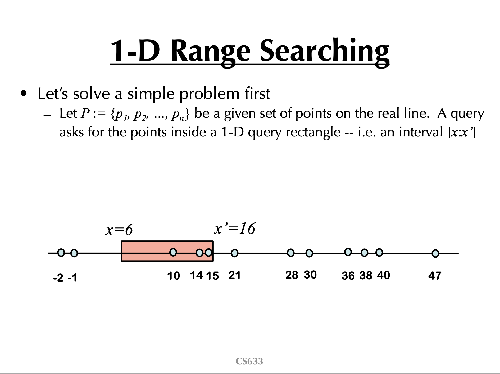
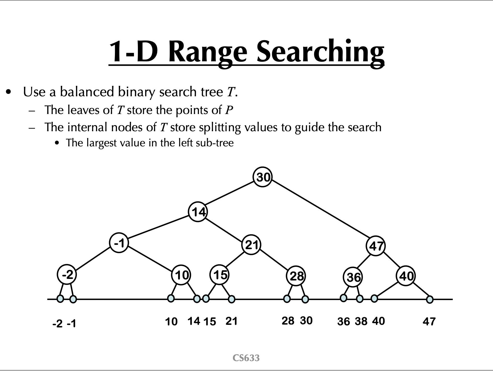

# kd-tree

## 一维空间搜索

这个问题怎么解决？
使用二分搜索树。将数组构建成一棵BST，然后在BST中进行递归地查询。
在查询的过程中配合一定的剪枝操作。

https://cs.gmu.edu/~jmlien/teaching/09_fall_cs633/uploads/Main/lecture07.pdf

乔治梅森大学的这个图我有点没理解。
或许，这个图只是一个抽象结构，并不是说在代码中构建一棵这样的树。
我的实现是按照普通的BST进行实现。  
参考的方法是：https://www.coursera.org/lecture/algorithms-part1/1d-range-search-wSISD

## 参考资料
1. https://users.cs.utah.edu/~lifeifei/cs6931/kdtree.pdf
资料中讲述的一维搜索就是之前长亭科技的笔试题。（若干一维坐标轴上的点，给定一个区间，返回这个区间中包含了多少个点）
当时用了线段树。这篇文章告诉我们可以使用二分搜索树。
